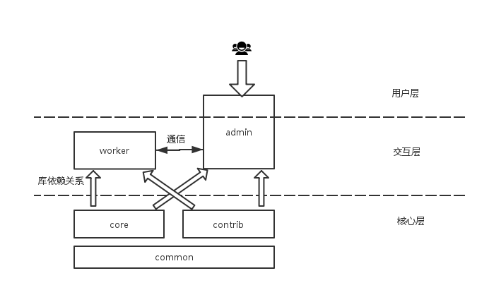

# Jscrapy
[](https://travis-ci.org/jscrapy/jscrapy)
[](https://bitdeli.com/free "Bitdeli Badge")
## 功能
- 用户友好,一个管控界面解决全部问题
- 动态上线，新站点抓取无需重新发布部署。
- 天生分布式。支持集群动态扩、缩容、分组
- 精准解析。解析脚本化，支持Groovy, Javascript, python
- 支持的去重方式：redis, mongodb, ehcache, 内存
- 支持的队列： redis, mongodb(可靠抓取), ehcache, 内存
- 支持伪分布式：一台机器模拟集群。
- 支持大集群虚拟分组功能：隔离故障，降低维护成本。
- 模块化：方便地使用脚本在运行时控制proxy，http header, url
- 直接对接maven库，让部署新任务自动化、规范化
- 分布式自动调度：无论单机还是多机都提供可靠的调度。不重复，不遗漏。
- 提供低资源占用的js动态渲染解决方案：抓取ajax内容从此简单。
- 增量抓取功能：新闻，股票，竞品数据...
- 多页面数据合并功能：一条完整数据横跨几个页面?没关系！
- 分页抓取功能，毫无乱序。
- 支持URL优先级。
- 提供辅助功能，利用机器学习实现无解析化抓取（实验特性）
- 提供多种数据持久化策略：无论您想直接保存在db，还是希望实时处理，想要的都可以满足。
- 登录：你懂的。
- 验证码破解服务：你懂的，不罗嗦。
- 提供多种变幻莫测的代理策略：当然你只需要管控界面上动动鼠标。
- 解析太头疼？看看解析工具里的武器。表格，列表只需一条语句。
- OCR太深奥？我都给你包好了，绝不放过任何一条数据。

## 使用手册TODO



## 特别感谢

```text
If I have been able to see further, it was only because I stood on the shoulders of giants.  
                                                                          --Newton
```
本产品的开发借鉴或者复用了很多优秀的开源软件。特别感谢

- webmagic
- scrapy
- SeimiCrawler
- gecco


