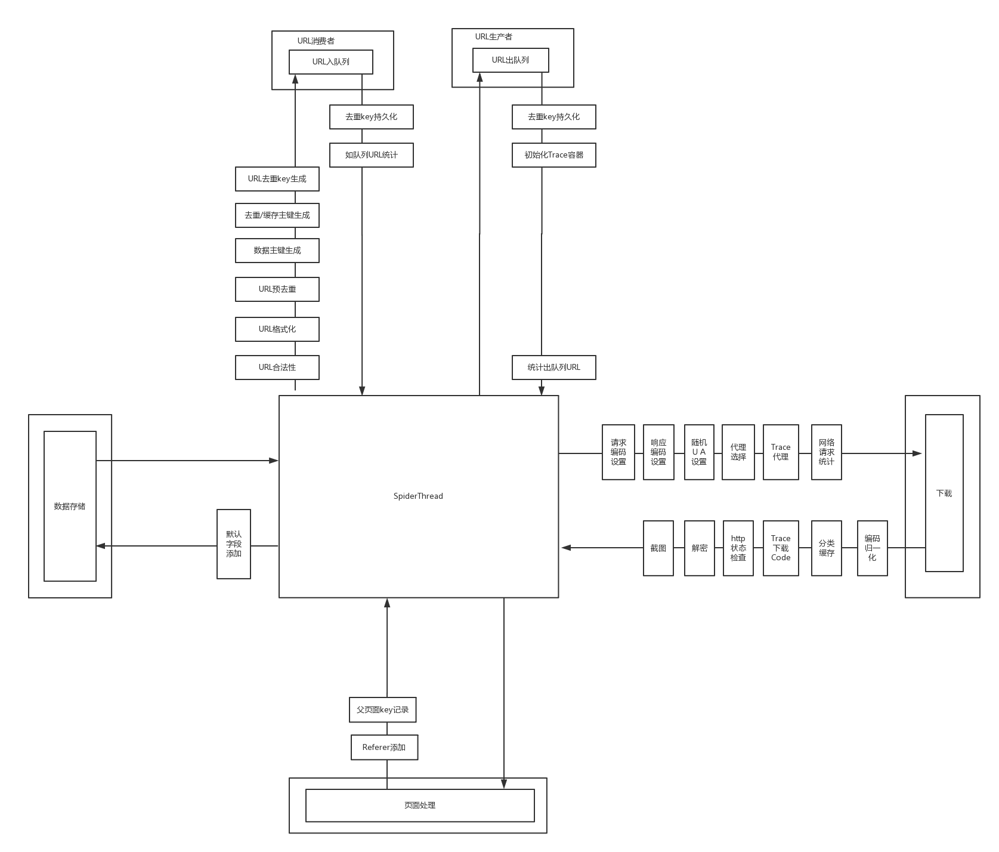

# 本节目录

- Jscrapy简介
- 用例
- 设计思路
- 工程物理结构 
- 系统分层
- 部署架构

## Jscrapy简介
Jscrapy建立在作者在某首富公司多年垂直爬虫领域的积累之上，丰富的应用场景和严酷的
业务挑战让Jscrapy不再只是一个玩具。可以说无论是架构还是功能上，Jscrapy都堪称是千锤
百炼的工业级平台！

为什么名字叫Jscrapy？简单点理解就是java实现的scrapy。除此之外[scrapy](https://github.com/scrapy/scrapy)
真的是一个很棒的爬虫框架，作者从中受益良多也参考了很多它的设计。但是Jscrapy又有一些自己独有的特色：

- 基于最新的java平台，稳定，更适合团队作战
- 全自动化的任务部署，可对接maven仓库或者git仓库
- 天生分布式和虚拟集群支持，动态扩容、缩容
- 独一无二的异常处理体系，绝对不丢失一个网页
- 无论是单机还是分布式部署完全无需配置
- 基于机器负载动态调度任务
- 支持更加丰富的应用场景，例如监控站点、一键搬家、优先级、回调通知，任务流等

## 设计思路


## 工程物理结构

```text
jscrapy/
    |----jscrapy-admin/    #管控
    |----jscrapy-service/  #核心服务
    |----jscrapy-contrib/  #核心扩展
    |----jscrapy-core/
    |----jscrapy-common/   
    |----jscrapy-docs/     # 文档目录
```

* `jscrapy-admin`  系统管控，可视化任务上线，管理。
* `jscrapy-service`  被动式爬虫服务，爬虫执行抓取的核心。
* `jscrapy-contrib`  存储，队列等模块扩展。
* `jscrapy-core`  爬虫核心。
* `jscrapy-common`  基础库。
* `jscrapy-docs`  文档。

## 系统分层


## 部署架构
Jscrapy支持两种部署模式：

- 单机模式，适合开发、测试或者小批量数据临时抓取。但是单机同样提供了数据的完整性支持。
- 集群模式，适合生产环节，短时间抓取大规模网站。

### 集群部署架构


详细部署方法参考[集群部署详情](cluster_deploy_arch/)
### 单机部署架构


详细部署方法参考[单机部署详情](single_deploy_arch/)

