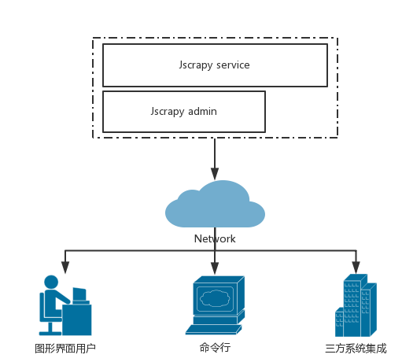
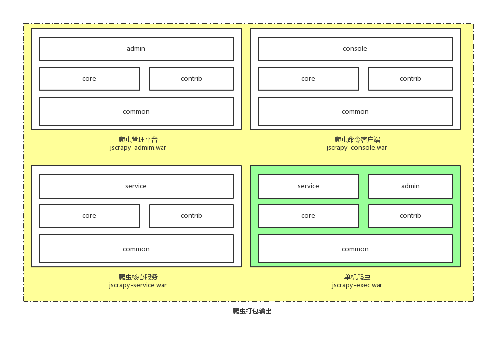

# 用户手册

## 用例


## 程序包介绍


jscrapy一共产生了4个[可执行war包]()。

- jscrapy-admin.war 管控平台。
- jscrapy-console.war 命令行模式客户端。
- jscrapy-service.war 爬虫核心服务。
- jscrapy-exec.war 特为单机状态打包的一键安装包，实际是把管控和核心服务打包在一起方便部署。

## 部署
爬虫部署可以简单分为单机部署和集群部署两种方式。如果你的应用，对可用性要求不是
那么严格，并且机器资源有限可以采用单机部署的方式。如果你要在生产环境使用，那么建议
部署为集群模式，能够发挥多台机器并行处理的能力。

### 单机模式
1. 单机模式下，最简单部署方法就是将 `jscrapy-exec.war`上传到服务器，然后执行 
```shell
$java -jar jscrapy-exec.war
```
这样你就能通过这台机器的IP登录管理平台，然后进行操作。

2. 另外一种方式是只上传`jscrapy-service.war`到服务器，然后执行
```shell
$java -jar jscrapy-service.war
```
最后配合 `jscrapy-console.war`或者本机启动 `jscrapy-admin.war`对系统进行使用。

### 集群模式

1. 把`jscrapy-service.war`部署到多台机器上启动： `$java -jar jscrapy-service.war`
2. 在多机启动`jscrapy-admin.war`: 过程中需要配置postgreSql地址。
